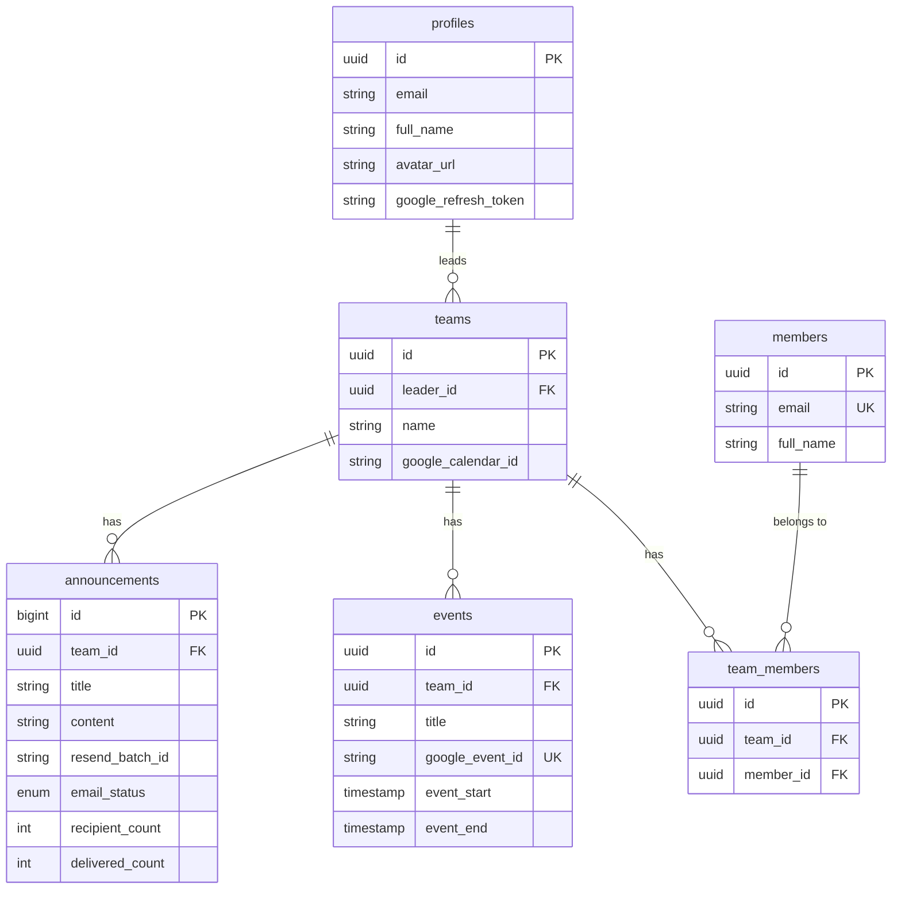

<p align="center">
  
</p>

<h1 align="center">Taskboard</h1>

<p align="center">
  <strong>Where teams get sh*t done.</strong>
  <br />
  A team management platform built to solve the chaos of organizing events across classes and organizations in college.
</p>

<p align="center">
  <a href="https://www.taskboard.page">Live App</a> · <a href="https://www.taskboard.page/terms">Terms</a> · <a href="https://www.taskboard.page/privacy">Privacy</a>
</p>

---

## The Problem

In college, students juggle memberships across multiple organizations, classes, and committees. Event schedules are scattered across group chats, emails, and word of mouth. Leaders waste time manually coordinating announcements, and members miss important events because there's no single source of truth.

**Taskboard fixes this** by giving every team a shared workspace with a calendar, member roster, and announcement system — all synced directly to Google Calendar.

---

## Features

### 🗓️ Team Calendar

- Create, edit, and delete events per team
- **Two-way sync with Google Calendar** — events appear on members' personal calendars automatically
- Month/week/day views powered by `react-big-calendar`

### 👥 Member Management

- Add members individually or **bulk import via CSV**
- Inline validation and duplicate detection
- Searchable, sortable data tables powered by TanStack Table

### 📢 Announcements

- Compose rich-text announcements with a **Tiptap editor** (bold, italic, lists)
- **Batch email delivery** to all team members via Resend API
- Real-time delivery tracking with webhook status updates (Sent, Delivered, Failed)
- Supports batches of 100+ recipients with automatic splitting

### 🔐 Authentication

- Google OAuth via Supabase Auth
- Automatic profile creation on first login
- Secure session management with `@supabase/ssr` middleware

---

## Tech Stack

| Layer              | Technology                                                  |
| :----------------- | :---------------------------------------------------------- |
| **Framework**      | [Next.js 16](https://nextjs.org/) (App Router, Turbopack)   |
| **Language**       | TypeScript                                                  |
| **Styling**        | Tailwind CSS 4                                              |
| **UI Components**  | Radix UI, Lucide Icons, Class Variance Authority            |
| **Database**       | PostgreSQL via [Supabase](https://supabase.com/)            |
| **ORM**            | [Prisma](https://www.prisma.io/) with `@prisma/adapter-pg`  |
| **Auth**           | Supabase Auth + Google OAuth 2.0                            |
| **Email**          | [Resend](https://resend.com/) + React Email + Svix webhooks |
| **Calendar**       | Google Calendar API via `googleapis`                        |
| **Rich Text**      | Tiptap                                                      |
| **Tables**         | TanStack React Table                                        |
| **Forms**          | React Hook Form + Zod validation                            |
| **Error Tracking** | [Sentry](https://sentry.io/)                                |
| **Hosting**        | [Vercel](https://vercel.com/)                               |
| **Domain**         | `taskboard.page`                                            |

---

## Architecture

```
┌──────────────────────────────────────────────────────────┐
│                     Vercel (Next.js 16)                   │
│                                                          │
│  ┌─────────┐  ┌──────────┐  ┌────────────┐  ┌────────┐  │
│  │  Login   │  │Dashboard │  │Team Workspace│ │Legal   │  │
│  │  Page    │  │  (Teams) │  │Cal/Members/  │ │Pages   │  │
│  │         │  │          │  │Announcements │ │        │  │
│  └────┬────┘  └────┬─────┘  └──────┬───────┘ └────────┘  │
│       │            │               │                      │
│  ┌────▼────────────▼───────────────▼──────────────────┐   │
│  │           Supabase Auth Middleware (proxy.ts)       │   │
│  └────────────────────┬───────────────────────────────┘   │
│                       │                                   │
│  ┌────────────────────▼───────────────────────────────┐   │
│  │              Server Actions (actions/)              │   │
│  │     teams.ts · members.ts · announcements.ts        │   │
│  └──┬──────────┬──────────────┬───────────────────────┘   │
│     │          │              │                            │
│     ▼          ▼              ▼                            │
│  Prisma    Google API      Resend                         │
│     │          │              │                            │
└─────┼──────────┼──────────────┼────────────────────────────┘
      │          │              │
      ▼          ▼              ▼
  Supabase    Google       Resend API
  PostgreSQL  Calendar     + Webhooks
```

---

## Database Schema (Public)



---

## Getting Started

### Prerequisites

- Node.js 18+
- A [Supabase](https://supabase.com/) project
- A [Google Cloud](https://console.cloud.google.com/) project with Calendar API enabled
- A [Resend](https://resend.com/) account

### 1. Clone & Install

```bash
git clone https://github.com/your-username/taskboard.git
cd taskboard
npm install
```

### 2. Environment Variables

Create a `.env` file in the project root:

```env
# App
NEXT_PUBLIC_APP_URL=http://localhost:3000

# Supabase
NEXT_PUBLIC_SUPABASE_URL=your_supabase_url
NEXT_PUBLIC_SUPABASE_PUBLISHABLE_KEY=your_supabase_anon_key
DATABASE_URL=your_pooled_connection_string
DIRECT_URL=your_direct_connection_string

# Google OAuth
NEXT_PUBLIC_GOOGLE_CLIENT_ID=your_google_client_id
SUPABASE_AUTH_EXTERNAL_GOOGLE_CLIENT_SECRET=your_google_client_secret

# Resend
RESEND_API_KEY=your_resend_api_key
RESEND_WEBHOOK_SECRET=your_resend_webhook_secret
```

### 3. Database Setup

```bash
npx prisma generate
npx prisma migrate dev
```

### 4. Run

```bash
npm run dev
```

Visit `http://localhost:3000`

---

## Scripts

| Command                 | Description                          |
| :---------------------- | :----------------------------------- |
| `npm run dev`           | Start development server (Turbopack) |
| `npm run build`         | Production build                     |
| `npm run start`         | Start production server              |
| `npm run lint`          | Run ESLint                           |
| `npm run test`          | Run Jest tests                       |
| `npm run test:watch`    | Run tests in watch mode              |
| `npm run test:coverage` | Generate test coverage report        |

---

## Project Structure

```
Taskboard/
├── app/
│   ├── (auth)/login/         # Login page + Google OAuth
│   ├── dashboard/            # Team selection dashboard
│   │   ├── components/       # Dashboard UI components
│   │   └── teams/[teamsId]/  # Team workspace
│   │       ├── (calendar)/   # Calendar tab
│   │       ├── (members)/    # Members tab
│   │       └── (announcements)/ # Announcements tab
│   ├── privacy/              # Privacy Policy
│   ├── terms/                # Terms of Service
│   └── auth/callback/        # OAuth callback handler
├── actions/                  # Server actions
│   ├── teams.ts
│   ├── members.ts
│   └── (announcements)/
├── components/               # Shared UI components
├── lib/                      # Utilities (Resend, Google Calendar)
├── prisma/                   # Schema & migrations
├── utils/                    # Supabase clients, Prisma client
└── supabase/functions/       # Edge Functions
```

---

## Deployment

Taskboard is deployed on **Vercel** with automatic deploys from the `main` branch.

1. Connect your GitHub repo to Vercel
2. Set all environment variables in the Vercel dashboard
3. Set `NEXT_PUBLIC_APP_URL` to your production domain
4. Push to `main` — Vercel handles the rest

---

## License

This project is open-source under the [MIT License](LICENSE).

---

<p align="center">
  Built with ☕ for college students who are tired of missing org events.
</p>
